---
theme:
  name: tokyonight-storm
  override:
    footer:
      style: template
      left: "@orhun.dev"
      right: "Tokyo Rust Meetup"
---

<!-- new_lines: 1 -->


<!-- no_footer -->

<!-- end_slide -->


<!-- alignment: center -->

**Rustでポケットサイズのターミナル UIを作る** 🦀

_Rust Tokyo Meetup 🇯🇵_

---

**Orhun Parmaksız -  パルマクシズ オルフン**

`@orhun.dev` | `@ratatui.rs`

<!-- no_footer -->

<!-- end_slide -->

<!-- column_layout: [1, 1] -->

<!-- column: 0 -->


<!-- column: 1 -->

<!-- new_lines: 2 -->

# **Orhun Parmaksız**

🇹🇷 **アンカラ、トルコ**在住のクリエイター

🦀 _オープンソース、Rust、そしてターミナル!_

🐭 **Ratatui**、**Ratzilla**、**git-cliff** など...

📦 **Arch Linux** (btw)

---

`https://github.com/orhun`  
`https://youtube.com/@orhundev`

<!-- end_slide -->

<!-- alignment: center -->

<!-- new_lines: 3 -->

**ネズミを想像してください。**

<!-- pause -->


<!-- pause -->

_ネズミはMP3をダウンロードしたい_

<!-- pause -->

_ネズミはytmp3downloader.ccに移動する_

<!-- no_footer -->

<!-- end_slide -->


<!-- pause -->

<!-- jump_to_middle -->


<!-- alignment: center -->

<!-- no_footer -->

<!-- end_slide -->

<!-- no_footer -->

<!-- alignment: center -->

<!-- new_lines: 3 -->

**ネズミを想像してください（もう一度）**


<!-- pause -->

_ネズミはcheese.txtを探している_

<!-- pause -->

_ネズミはファイル検索を使う_

<!-- end_slide -->

<!-- no_footer -->


<!-- pause -->


<!-- pause -->


<!-- pause -->

<!-- jump_to_middle -->


<!-- end_slide -->

<!-- alignment: center -->

<!-- new_lines: 3 -->

<!-- no_footer -->

**ネズミを想像してください（ごめんね）**

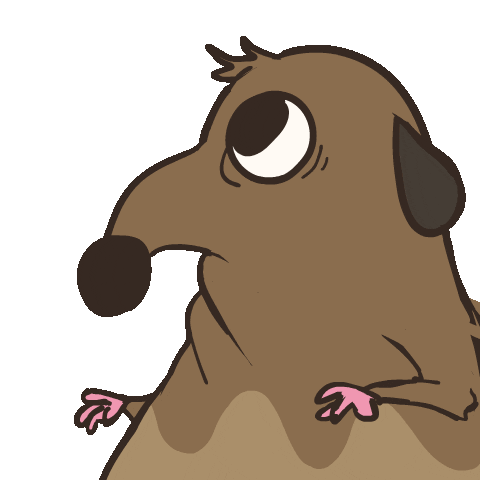

<!-- pause -->

_ネズミはネットワークトラフィックを監視したい_

<!-- pause -->

_ネズミはGUIツールを起動する_

<!-- pause -->

<!-- end_slide -->

<!-- no_footer -->


<!-- end_slide -->


<!-- alignment: center -->

_ネズミは爆発した。_

<!-- no_footer -->

<!-- end_slide -->

# 解決策は？

<!-- pause -->

ターミナルです。

<!-- pause -->

```bash
$ yt-dlp -f bestaudio --extract-audio --audio-format mp3
```

<!-- pause -->

```bash +exec +acquire_terminal
ig 'fn main' /home/orhun/gh/
```

<!-- pause -->

```sh +exec +acquire_terminal
sudo oryx -i wlp3s0
```

<!-- end_slide -->

<!-- new_lines: 2 -->


<!-- no_footer -->

<!-- end_slide -->


<!-- end_slide -->


<!-- alignment: center -->

**https://ratatui.rs**

<!-- pause -->

---

> Ratatuiは、ターミナルユーザーインターフェース（TUI）を料理するためのRustライブラリです。

- `2023年`から存在（`tui-rs`からのフォーク）

- `250人以上`の貢献者、数百のアプリ、`800万回以上`のクレートダウンロード

- `tokio-console`、`yazi`、`dioxus-cli`、`atuin`、`gitui`等

- `Netflix`、`OpenAI`、`OVHcloud`など多くの企業で使用

<!-- end_slide -->

```bash +exec
handlr open https://github.com/openai/codex/pull/629
```

<!-- end_slide -->

# TUIの例

<!-- alignment: center -->


[](https://github.com/zaghaghi/openapi-tui)

<!-- end_slide -->

# TUIの例

<!-- alignment: center -->

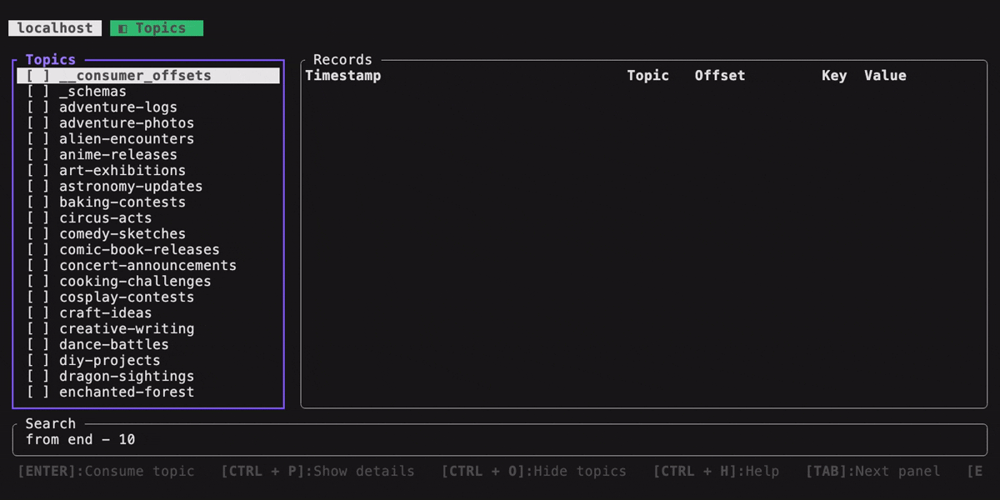

[](https://github.com/MAIF/yozefu)

<!-- end_slide -->

他には？

<!-- pause -->

```bash +exec +acquire_terminal
exabind
```

<!-- pause -->

```bash +exec
handlr open https://orhun.dev/ratzilla/demo/
```

<!-- pause -->

```
rebels-in-the-sky
```

<!-- end_slide -->

<!-- end_slide -->

<!-- alignment: center -->

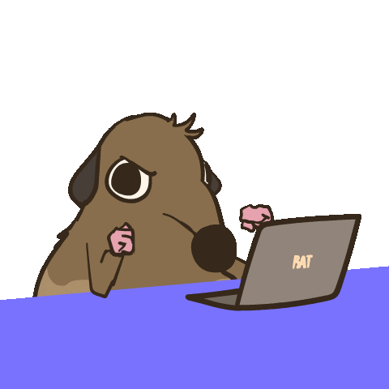

_見せろ！_

<!-- end_slide -->

<!-- alignment: center -->

<!-- new_lines: 1 -->

簡単です。

```rust {1-13|2|3|4-6|8-10|1-13} +line_numbers
fn main() -> std::io::Result<()> {
    ratatui::run(|terminal| {
        loop {
            terminal.draw(|frame|
                frame.render_widget("rat", frame.area())
            )?;

            if crossterm::event::read()?.is_key_press() {
                break Ok(());
            }
        }
    })
}
```

<!-- pause -->

_それともチーズっぽい？正直わからない_

<!-- end_slide -->

## テンプレート

<!-- alignment: center -->

| テンプレート | 説明 |
| ------------------ | -------------------------------------- |
| Hello World        | 「Hello, World!」の例                  |
| Simple             | シンプルな例                           |
| Simple Async       | シンプルな非同期の例                   |
| Event Driven       | イベント駆動型TUIアプリケーション      |
| Event Driven Async | 非同期イベント駆動型TUIアプリケーション |
| Component          | コンポーネントベースのTUIアプリケーション |

```bash
cargo generate ratatui/templates
```


<!-- end_slide -->

# アーキテクチャ (>=v0.30)

<!-- column_layout: [1, 1, 1] -->

<!-- column: 0 -->

### ウィジェット

- BarChart
- Calendar
- Canvas
- Chart
- Sparkline
- Table
- `impl Widget`
- ...

<!-- column: 1 -->

### バックエンド

- Crossterm
- Termion
- Termwiz
- `impl Backend`

<!-- column: 2 -->

### コンポーネント

ratatui  
├── `ratatui-core`  
├── `ratatui-widgets`  
├── ratatui-crossterm  
├── ratatui-termion  
├── ratatui-termwiz  
└── ratatui-macros

<!-- reset_layout -->

<!-- alignment: center -->


<!-- pause -->

_しかし、ここで終わりではありません_

<!-- end_slide -->

<!-- alignment: center -->


`スズキ バレーノ`でRatatui  
[](https://github.com/thatdevsherry/suzui-rs)

<!-- end_slide -->

<!-- new_lines: 1 -->

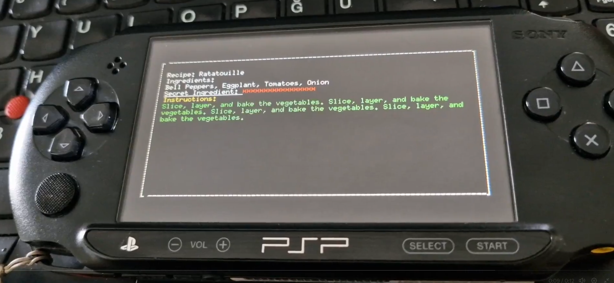

<!-- alignment: center -->

`PSP`でRatatui  
`https://github.com/overdrivenpotato/rust-psp/pull/190`

<!-- end_slide -->

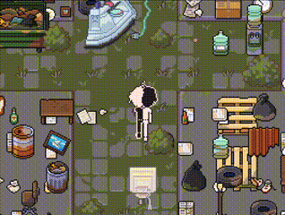

<!-- alignment: center -->

`j-g00da`によるRadioforestrion RPG（開発中）

<!-- end_slide -->

<!-- new_lines: 1 -->

名前を付けると：

<!-- pause -->


<!-- alignment: center -->

_https://www.urbandictionary.com/define.php?term=ratatuify_

<!-- pause -->

_でも、どうやって可能なの？_ 🤔

<!-- end_slide -->

### impl Backend

```rust
pub trait Backend {
    fn draw<'a, I>(&mut self, content: I) -> Result<()>
       where I: Iterator<Item = (u16, u16, &'a Cell)>;
    fn hide_cursor(&mut self) -> Result<()>;
    fn show_cursor(&mut self) -> Result<()>;
    fn get_cursor_position(&mut self) -> Result<Position>;
    fn set_cursor_position<P: Into<Position>>(
        &mut self,
        position: P,
    ) -> Result<()>;
    fn clear(&mut self) -> Result<()>;
    fn size(&self) -> Result<Size>;
    fn window_size(&mut self) -> Result<WindowSize>;
    fn flush(&mut self) -> Result<()>;
    // ...
}
```

<!-- end_slide -->

### カスタムバックエンド

| リポジトリ | 説明 |
| ----------------------------------- | -------------------------------------- |
| _reubeno_/`ratatui-uefi`            | UEFI                                   |
| _j-g00da_/`mousefood`               | embedded-graphicsバックエンド          |
| _Jesterhearts_/`ratatui-wgpu`       | GPU加速レンダリング                    |
| _gold-silver-copper_/`egui_ratatui` | EGUIウィジェット                       |
| _gold-silver-copper_/`soft_ratatui` | 純粋なソフトウェアレンダリング         |
| _cxreiff_/`bevy_ratatui_camera`     | Bevyアプリをターミナルにレンダリング   |
| _orhun_/`ratzilla`                  | Web                                    |


<!-- new_lines: 1 -->

<!-- end_slide -->

続き、今日は次についてマウシ🐁あげます：

<!-- pause -->


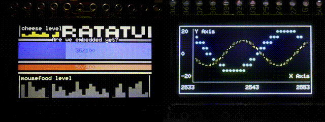

<!--alignment: center-->

_mousefood_！

<!-- end_slide -->


<!-- end_slide -->

# ハードウェアを知ろう！

**ESP32** by Espressif Systems

- 最大240MHzのデュアルコア32ビットMCU、Wi-Fi + Bluetooth搭載
- 520 KB SRAM、外部フラッシュ/PSRAMをサポート
- 豊富なI/O：ADC、DAC、SPI、I²C、UART、PWM、タッチセンサー

<!-- column_layout: [1, 1, 1]-->

<!-- column: 0 -->

<!-- new_lines:  2-->


<!-- column: 1 -->


<!-- column: 2 -->


<!-- end_slide -->

# フレームワーク

<!-- column_layout: [1, 1] -->
<!-- column: 0 -->

## **esp-hal**

- ベアメタル（`#![no_std]`）
- Espressifが資金提供

<!-- column: 1 -->

## **esp-idf-hal**

- `std`サポート付き！
- コミュニティの取り組み
- カスタムツールチェーンが必要

<!-- reset_layout -->

<!-- column_layout: [2, 3] -->
<!-- column: 0 -->

<!-- pause -->

## ツールチェーン

```sh
cargo install espup
espup install
```

```sh
cargo install espflash
```

<!-- column: 1 -->

<!-- pause -->

`.cargo/config.toml`:

```toml
[build]
target = "xtensa-esp32-espidf"

[target.xtensa-esp32-espidf]
linker = "ldproxy"
runner = "espflash flash --monitor"
rustflags = [ "--cfg",  "espidf_time64"]
```

<!-- end_slide -->

```bash +exec +acquire_terminal
esp-generate
```

<!-- alignment: center -->

[](https://github.com/esp-rs/esp-generate)

**Ratatui**で構築！🐭


<!-- end_slide -->

<!-- new_lines: 2 -->

<!-- alignment: center -->

それで、_カニ？_

<!-- pause -->

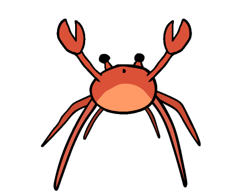

ヨッッッッシャア～！！！！

<!-- pause -->

_それでもネズミは？_

<!-- end_slide -->

### Ratatui + embedded-graphics = **Mousefood**

<!-- column_layout: [4, 3] -->

<!-- column: 0 -->

- `embedded-graphics`上に構築
- カスタムビットマップフォントサポート

<!-- column: 1 -->


<!-- reset_layout -->

```rust {1-9|2|4|5|7-9|1-9}
// あらゆるembedded_graphics DrawTarget
let mut display = MyDrawTarget::new();

let backend = EmbeddedBackend::new(&mut display, EmbeddedBackendConfig::default());
let mut terminal = Terminal::new(backend)?;

loop {
    terminal.draw(...)?;
}
```

<!-- alignment: center -->

`https://github.com/j-g00da/mousefood`

<!-- end_slide -->

### シミュレーター 🤖

```rust {1-15|1-8|10|12-13|15|1-15}
let mut simulator_window = Window::new(
    "mousefood simulator",
    &OutputSettings {
        scale: 4,
        max_fps: 30,
        ..Default::default()
    },
);

let mut display = SimulatorDisplay::new(Size::new(128, 64));

let config = EmbeddedBackendConfig::default();
let backend = EmbeddedBackend::new(&mut display, config);

let mut terminal = Terminal::new(backend)?;
```

<!-- alignment: center -->

これでシミュレーターバックエンドでRatatuiを起動

<!-- end_slide -->


```bash +exec
cargo run --manifest-path ../mousefood/Cargo.toml -p simulator
```

<!-- end_slide -->

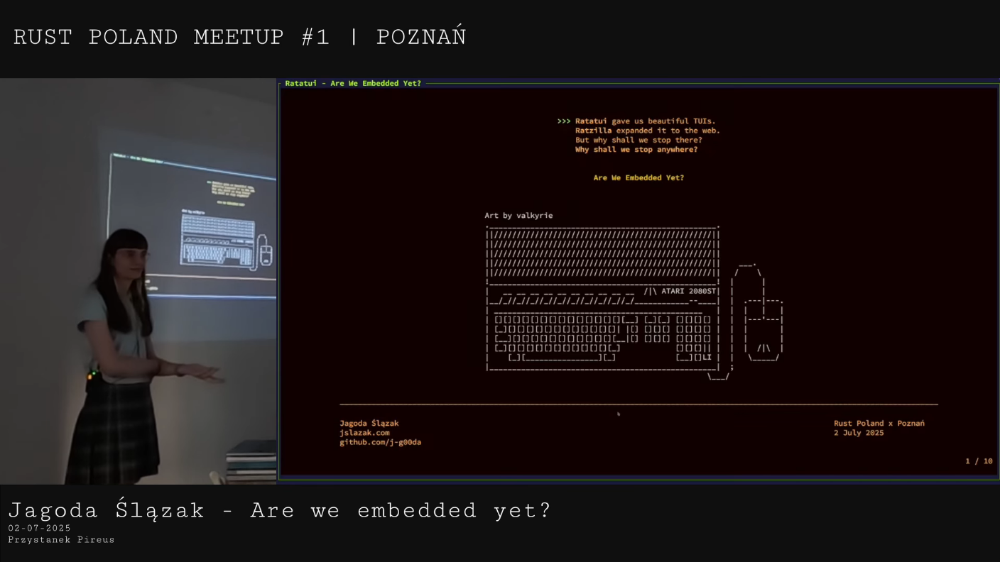

<!-- alignment: center -->

[](https://youtu.be/QPjojOuhbe8)  
Ratatuiは現在`no_std`です！

<!-- end_slide -->

<!-- new_lines: 3 -->

<!-- alignment: center -->

# デモタイム！


<!-- no_footer -->

<!-- end_slide -->

# では、何ができるでしょうか？

<!-- pause -->

ギターを学ぼう！

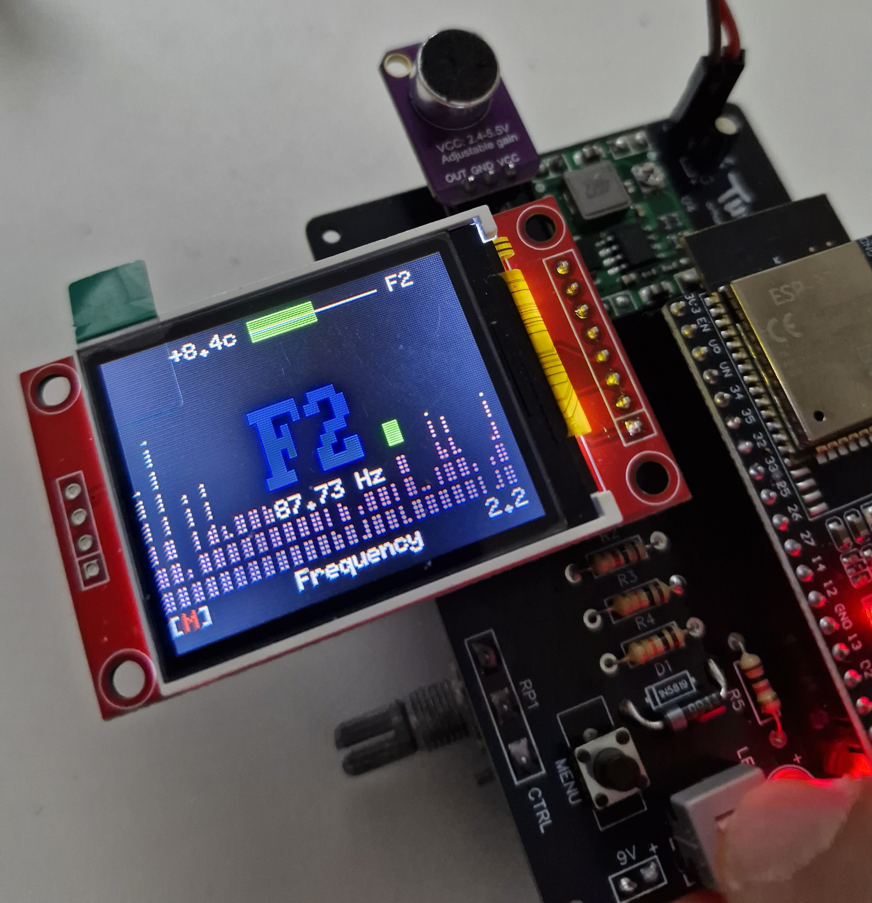

<!-- alignment: center -->

| _Rust、Ratatui、そして9Vバッテリーで動作！_

<!-- end_slide -->

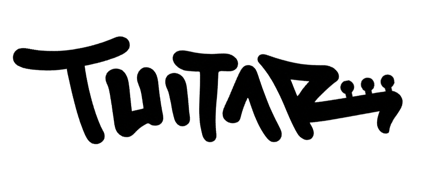

<!-- alignment: center -->

「_ポータブルでターミナルベースのギター訓練ツール_」

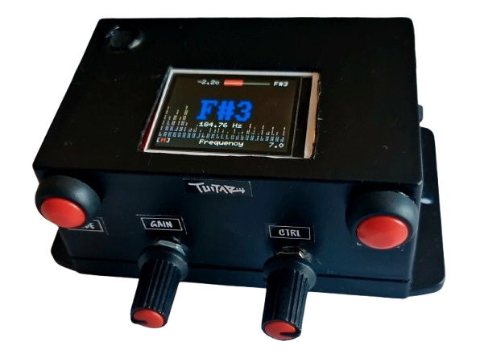

```sh +exec
mpv /home/orhun/downloads/tuitar-final.mp4
```

<!-- end_slide -->

<!-- new_lines: 1 -->


<!-- alignment: center -->

[](https://www.youtube.com/live/es48dmNWMVQ)

Rust Forgeでのライブデモ！

<!-- end_slide -->

<!-- column_layout: [5, 8] -->

<!-- column: 0 -->

### impl Widget

```rust
pub struct Fretboard {
    tuning: Vec<Note>,
    style: Style,
}
```

```rust
pub struct FretboardState {
    notes: Vec<Note>
}
```


<!-- column: 1 -->

```rust
impl StatefulWidget for &Fretboard {
    type State = FretboardState;

    fn render(
        self,
        area: Rect,
        buf: &mut Buffer,
        state: &mut Self::State,
    ) {
        for s in self.tuning.iter() {
            // ...
            buf.set_line(
                area.x,
                area.y + i as u16,
                &Line::from(spans),
                area.width,
            );
        }
    }
}
```

<!-- end_slide -->

## `ratatui-fretboard`ウィジェットの紹介 🎉

```rust
let fretboard = Fretboard::default();
let mut state = FretboardState::default();
state.set_active_note(Note::A(4));
frame.render_stateful_widget(fretboard, area, &mut state);
```

```
E4 ║─┼───┼───┼───┼───┼─⬤─┼───┼───┼───┼───┼───┼───║
B3 ║─┼───┼───┼───┼───┼───┼───┼───┼───┼───┼─⬤─┼───║
G3 ║─┼───┼───┼───┼───┼───┼───┼───┼───┼───┼───┼───║
D3 ║─┼───┼───┼─•─┼───┼─•─┼───┼─•─┼───┼─•─┼───┼───║
A2 ║─┼───┼───┼───┼───┼───┼───┼───┼───┼───┼───┼───║
E2 ║─┼───┼───┼───┼───┼───┼───┼───┼───┼───┼───┼───║
     1   2   3   4   5   6   7   8   9  10  11  12
```

<!-- alignment: center -->

文字列名、フレット、色など、すべてカスタマイズ可能です。

<!-- end_slide -->


<!-- end_slide -->

```
D0 ║─┼───┼───┼─⬤─┼───┼─⬤─┼───┼───┼───┼─⬤─┼───┼───┼───┼───║
G0 ║─┼───┼───┼───┼─⬤─┼───┼───┼───┼───┼─⬤─┼───┼───┼───┼───║
C0 ║─┼───┼─⬤─┼───┼───┼─⬤─┼───┼─⬤─┼───┼───┼───┼─⬤─┼───┼───║
F0 ║─┼───┼─⬤─┼───┼───┼───┼─⬤─┼───┼───┼───┼───┼─⬤─┼───┼───║
B0 ║─┼───┼───┼───┼───┼─⬤─┼───┼───┼───┼───┼─⬤─┼───┼─•─┼───║
E1 ║─┼───┼───┼─•─┼───┼─⬤─┼───┼─•─┼───┼─•─┼─⬤─┼───┼───┼───║
A1 ║─┼───┼───┼───┼───┼─⬤─┼───┼───┼───┼───┼─⬤─┼───┼─•─┼───║
D2 ║─┼───┼───┼───┼───┼─⬤─┼───┼───┼───┼─✖─┼─⬤─┼───┼─✖─┼───║
G2 ║─┼───┼───┼───┼─✖─┼─⬤─┼───┼─✖─┼───┼───┼───┼───┼───┼───║
C3 ║─┼───┼─✖─┼───┼───┼───┼───┼───┼───┼─✖─┼───┼───┼───┼───║
     1   2   3   4   5   6   7   8   9  10  11  12  13  14
```


<!-- end_slide -->

### フレットボード追跡


<!-- end_slide -->

### スケールモード


<!-- end_slide -->

### ランダムモード


<!-- end_slide -->

### 曲モード


<!-- end_slide -->

## TUItar

```sh +exec +acquire_terminal
tuitar
```


<!-- alignment: center -->

[](https://github.com/orhun/tuitar)

<!-- end_slide -->

<!-- alignment: center -->

<!-- new_lines: 3 -->

もっと見る？


_口で言うのは簡単、チーズを見せて。_

<!-- end_slide -->

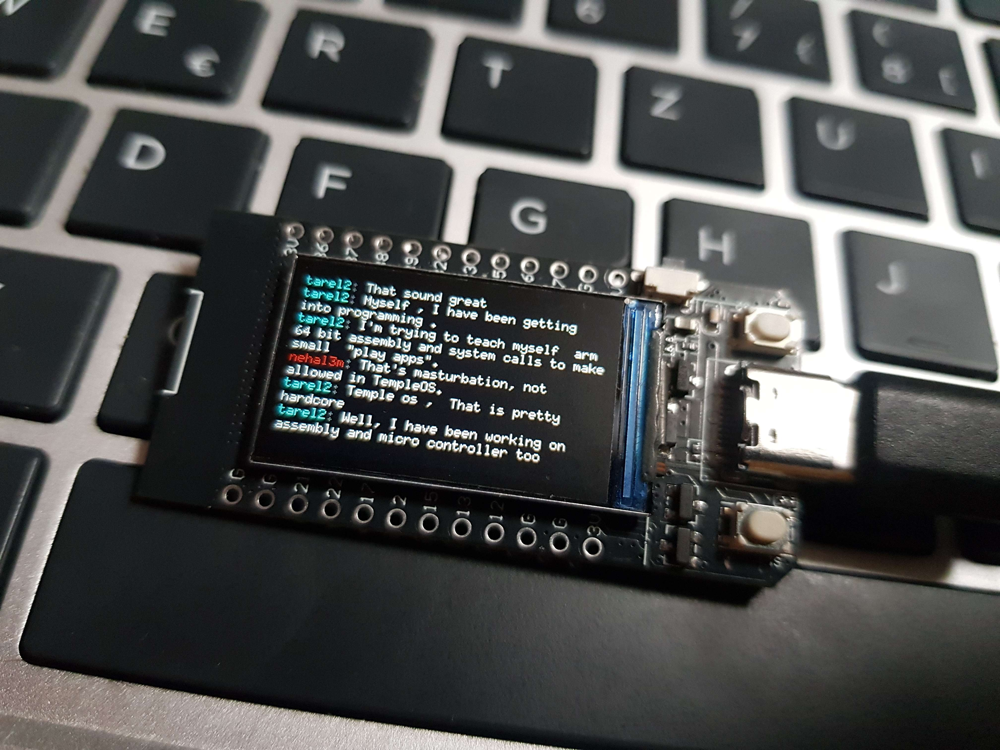

<!-- alignment: center -->

[](https://github.com/intuis/mnyaoo32)

<!-- end_slide -->

<!-- column_layout: [1, 4, 4, 1] -->

<!-- column: 1 -->


<!-- column: 2 -->


<!-- reset_layout -->

<!-- alignment: center -->

[](https://github.com/Julien-cpsn/Phone-OS)

<!-- end_slide -->

### アニメーション


<!-- alignment: center -->

[](https://github.com/junkdog/tachyonfx)経由

<!-- end_slide -->

## 課題


<!-- end_slide -->

### 大きい画面　＝＝　大きいトラブル

```
memory allocation of 153600 bytes failed
...
ili9341::graphics_core::<impl embedded_graphics_core::draw_target::DrawTarget for ili9341::Ili9341>::fill_contiguous
```

- `ST7735`：160 × 128 ≈ `20 KB`のピクセルデータ
- `ILI9341`：240 × 320 ≈ `150 KB`のピクセルデータ

<!-- pause -->

```rust
esp_alloc::heap_allocator!(size: 160 * 1024);
```

```ini
CONFIG_ESP_MAIN_TASK_STACK_SIZE=16384
```

<!-- end_slide -->

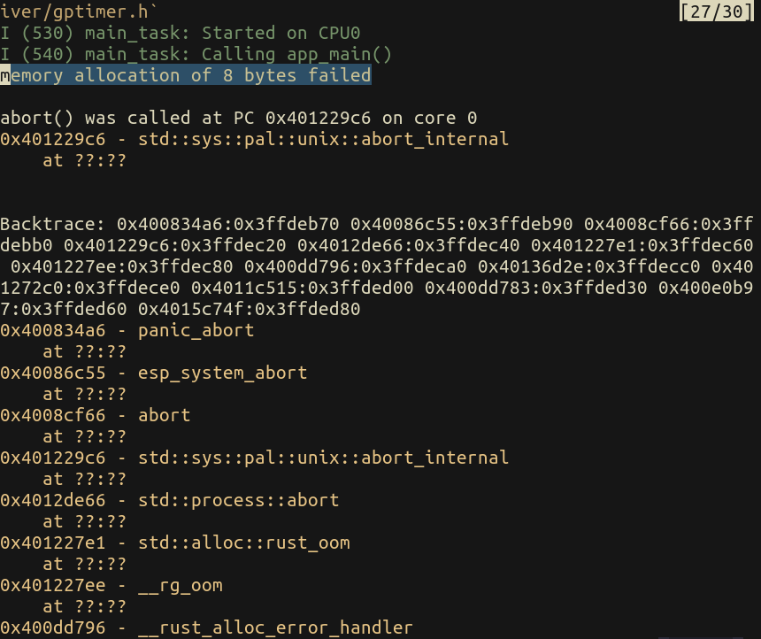

<!-- pause -->

<!-- jump_to_middle -->


<!-- end_slide -->

### ビルド地獄

`opt-level` > 1でランダムなパニック / loadprohibited / セマフォアサート

<!-- pause -->

```toml
[profile.release]
opt-level = 3

[profile.release.package."firmware"]
opt-level = 1

[profile.dev]
debug = true
opt-level = "z"
```

<!-- pause -->

<!-- alignment: center -->

LLVM最適化 + Xtensaバックエンドのバグ + 未定義動作(UDB)（割り当て、アライメント、ライフタイムなど）が原因

<!-- pause -->

つまり`苦痛`

<!-- jump_to_middle -->


<!-- end_slide -->

とっこで私の苦しみを見ることができる:

<!-- pause -->

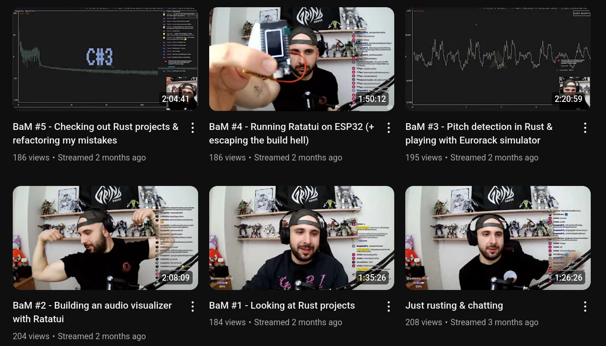

<!-- alignment: center -->

<!-- end_slide -->


<!-- end_slide -->

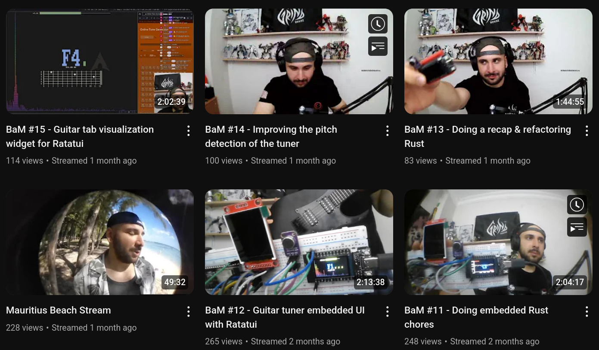

<!-- end_slide -->

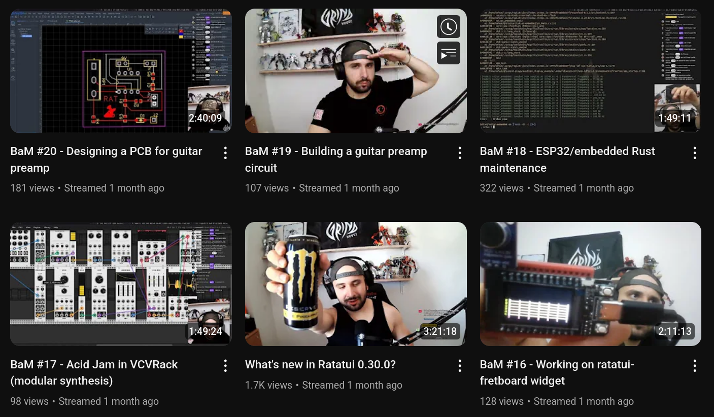

<!-- end_slide -->


<!-- end_slide -->

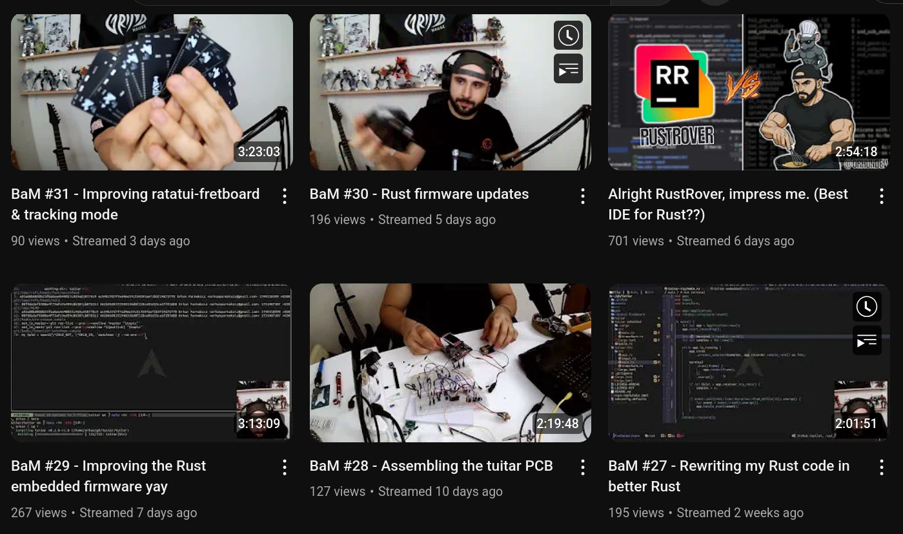

<!-- end_slide -->


<!-- alignment: center -->

[](https://www.youtube.com/@orhundev)

<!-- column_layout: [1, 2, 2, 1 ]-->

<!-- column: 1 -->


<!-- column: 2 -->

<!-- new_lines: 1 -->


<!-- end_slide -->

### 重要な一言！

<!-- pause -->

<!-- alignment: center -->


[](https://github.com/sponsors/orhun)

<!-- end_slide -->

<!-- alignment: center -->

<!-- no_footer -->

# ありがとうございました


`https://github.com/orhun`  
`https://youtube.com/orhundev`

---

✨ スライド：[](https://github.com/orhun/embedded-ratatui-workshop)  
`P.S. 私の帽子の下にネズミが隠れていません。`
